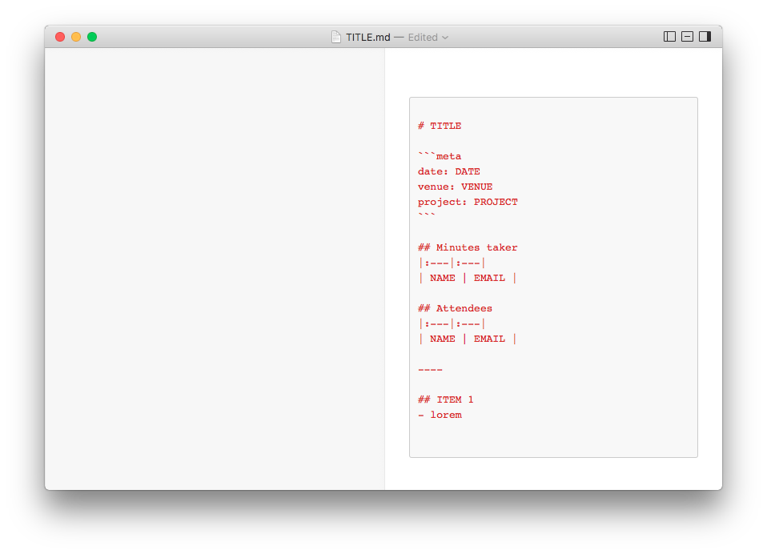

# iA Writer Template Minutes
Custom iAWrite template for taking Minutes of Meeting.

## Installation

**see:** [iA Writer Custom Templates](https://ia.net/writer/templates/)

> To install a template on Mac: double-click it in Finder, drag to the iA Writer Dock icon, or add in Preferences. Opening a template with iA Writer for iOS installs it as soon as you tap on it.

## Preview

